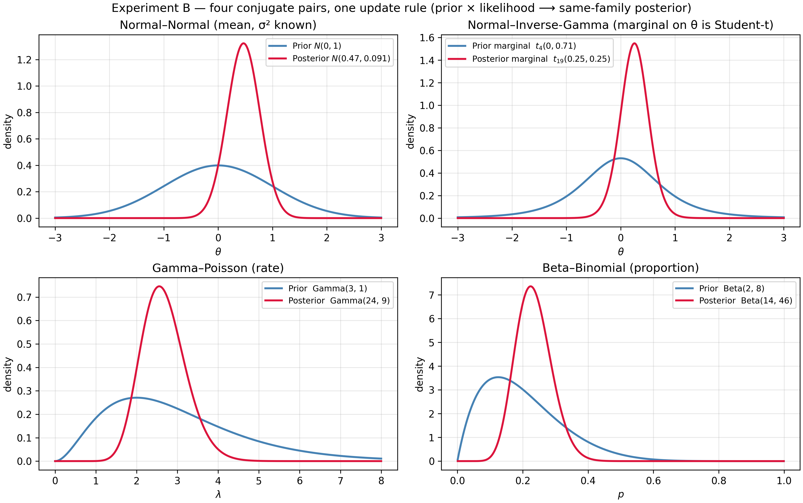
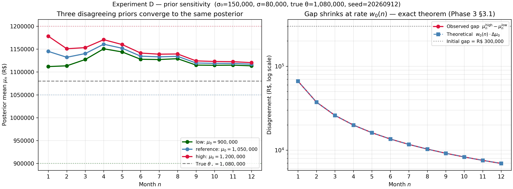
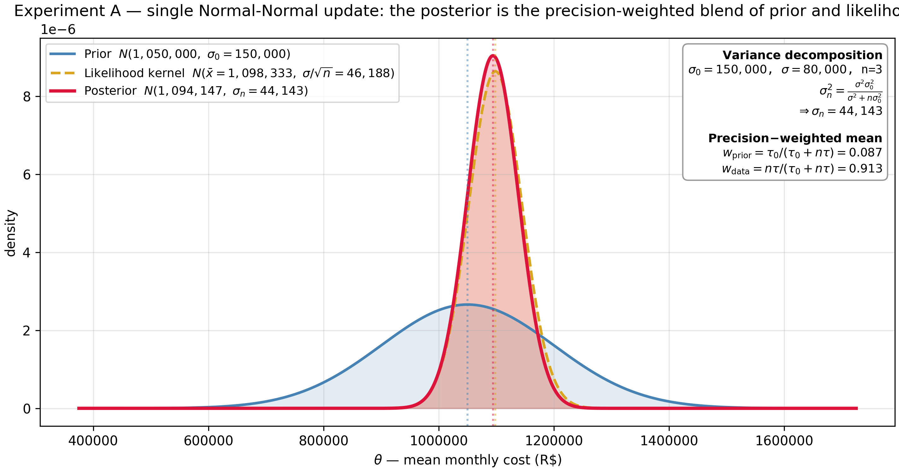
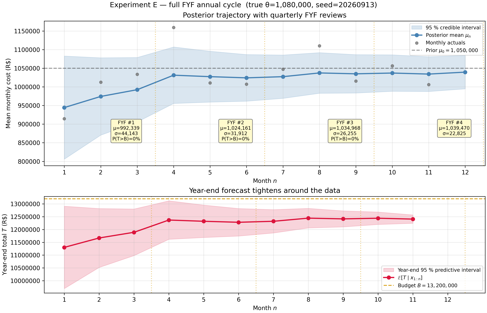
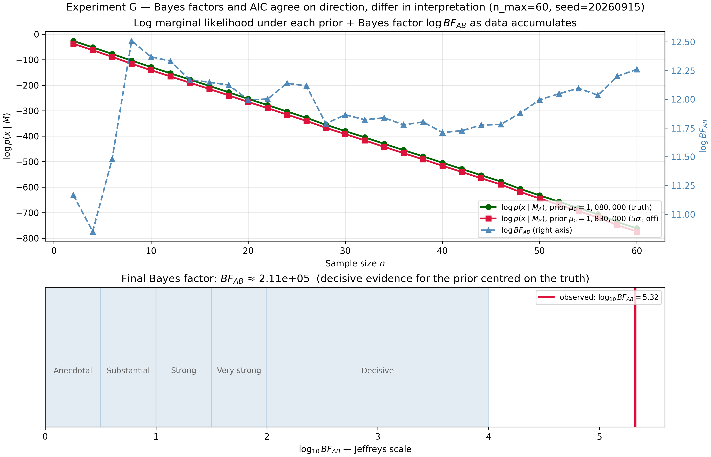

# The Budget That Learns

> **What this is.** A budget forecast that ignores its own history is a memoryless estimator — it discards the information accumulated in previous revisions and observed actuals. Bayesian updating provides the mathematically optimal way to combine prior beliefs (the original budget) with incoming evidence (monthly actuals): the posterior forecast is always at least as good as the prior, it sharpens monotonically as data arrives, and it automatically balances confidence in the plan against confidence in the data. **Each FYF cycle is not a new forecast — it is a Bayesian update.** The article's contribution is that closed-form conjugate updating is enough to explain and improve the whole revision cycle.
>
> **What you should know before reading.** *Required:* a solid undergraduate background — integration by substitution, completing the square, the Normal/LogNormal/Poisson distributions, the law of total variance, and Bayes' theorem in its discrete form. Every continuous result is derived from these in full. *Out of scope:* MCMC, hierarchical models, nonparametric Bayes, variational inference, and real company data.
>
> **What you will take away.** The four conjugate pairs that cover a budget model, the precision-weighted mean that replaces ad-hoc reweighting of plan vs actuals, the closed form for "what is the probability of ending the year over budget?", and the diagnostics that tell you when to stop trusting the machine.
>
> **Code.** Every figure and number is reproduced by versioned scripts with fixed seeds in the [companion repository](https://github.com/brunoramosmartins/bayesian-fyf-article).

---

## The Forecast That Learns

Every budget analyst lives the same calendar. December: a plan is
approved. April, July, October, January-of-next-year: a Forecast
Year-end Financial (FYF) review revises the plan against year-to-date
actuals. The revisions are quarterly; the questions are perennial.
*By how much should I move the forecast? How tight is my new estimate?
What is the chance of breaching the budget ceiling by year-end?*

The traditional answer treats each revision as a fresh estimate. The
analyst stares at year-to-date actuals, mentally weighs them against
the plan, and produces a new number. The new number is then defended
in a meeting; the defence is usually qualitative; the weight chosen
is rarely auditable.

This article argues that the FYF cycle is, in a precise mathematical
sense, **sequential Bayesian updating**. The plan is a *prior*. The
actuals are *data*. The revised forecast is a *posterior*. This is
not analogy; it is identity. And recognising the identity turns three
qualitative pain-points into closed-form results:

1. *How do I weight the plan against the data?* — The
 **precision-weighted mean** of the Normal–Normal posterior. The
 weights are not a matter of judgement: they are functions of the
 stated prior uncertainty and the per-month observation noise.
2. *How tight is my forecast?* — The posterior variance shrinks
 monotonically with each new month.
 [Sequential Updating and Shrinkage](#sequential-updating-and-shrinkage)
 makes this "monotonically" both rigorous and quantitative.
3. *What is the probability of ending the year over budget?* — The
 posterior **predictive** distribution applied to the unobserved
 months gives an exact closed form, not a heuristic.

The route from claim to proof is short.
[Bayes' Theorem for Budget Analysts](#bayes-theorem-for-budget-analysts)
derives the continuous theorem and clarifies the difference between
credible and confidence intervals.
[Conjugate Families](#conjugate-families) develops the four
prior–likelihood pairs that cover the FYF cost model.
[Sequential Updating and Shrinkage](#sequential-updating-and-shrinkage)
chains conjugate updates across the year and proves that sequential and
batch updating produce identical posteriors.
[The Posterior Predictive](#the-posterior-predictive) layers on top what
the CFO actually wants. [The FYF Model](#the-fyf-model) wires the
machinery into a complete annual cycle of a 50-person IT-headcount
budget; the [experiments](#experiments-and-results) validate it; and
[Diagnostics](#diagnostics) supplies the checks that decide when the
model is to be trusted and when its mechanical answer is misleading.

---

## Bayes' Theorem for Budget Analysts

Let $X$ denote observed data and $\theta$ an unknown parameter,
both treated as random variables. The **product rule for densities**
factorises the joint two ways:

$$
f(x, \theta) = f(x \mid \theta) \pi(\theta) = \pi(\theta \mid x) f(x).
$$

Equating and solving for the second factor gives **Bayes' theorem
for continuous parameters**:

$$
\boxed{\quad
\pi(\theta \mid x) = \frac{f(x \mid \theta) \pi(\theta)}{f(x)},
\qquad
f(x) = \int f(x \mid \theta) \pi(\theta) \mathrm d\theta.
\quad}
$$

The four objects have names. $\pi(\theta)$ is the **prior**; in FYF,
the budget plan expressed as a distribution. $f(x \mid \theta)$ is
the **sampling density**, viewed as a function of $\theta$ for fixed
$x$ it is the **likelihood**. $f(x)$ is the **marginal likelihood**
or evidence — the probability of the data averaged over the prior.
$\pi(\theta \mid x)$ is the **posterior**: the revised forecast.

Because $f(x)$ does not involve $\theta$, the proportional form
$\pi(\theta \mid x) \propto f(x \mid \theta) \pi(\theta)$ is
operationally enough. In conjugate families we recognise the
kernel of the right-hand side as that of a known distribution and
read off the hyperparameters; the marginal likelihood is implied by
the family and never has to be integrated.

### Point summaries

When a number is required:

- **Maximum a posteriori (MAP)**: $\hat\theta_{\text{MAP}} = \arg\max_\theta \pi(\theta \mid x)$.
- **Posterior mean**: $\hat\theta_{\text{PM}} = \mathbb E[\theta \mid x]$.
- **Posterior median**.

For symmetric unimodal posteriors (every Normal posterior in this
article) the three coincide. For a uniform prior the MAP equals the
maximum-likelihood estimator: a flat prior produces the classical
point estimate, but with a credible-interval interpretation that
remains different from a confidence interval — see below.

### Credible intervals vs confidence intervals

A **$100(1-\alpha)\%$ credible interval** for $\theta$ is any subset
$C$ with $\Pr(\theta \in C \mid x) = 1 - \alpha$. The most-used choice
is the equal-tailed interval bounded by the $\alpha/2$ and
$1 - \alpha/2$ posterior quantiles.

The contrast with the frequentist confidence interval is the
conceptual hinge of the article. The credible interval makes a
direct probability statement *about $\theta$* given the realised
data: "given what I saw, there is a 95 % chance the parameter lies
in $[a, b]$". The frequentist interval makes a statement *about the
procedure*: 95 % of the intervals constructed by this rule, across
hypothetical repetitions of the experiment, would contain the true
$\theta$. After observing one specific dataset, the frequentist
interval either contains $\theta$ or it does not — there is no
probability statement about *that* interval. Both intervals can
numerically agree in simple cases, but their interpretations differ.

For a budget committee asking "will we exceed R\$ 13.2 M?" the
relevant statement is about the parameter (or the forecast), not
about the procedure. The credible interval is the operational
object.

### Prior elicitation: the budget plan IS a prior

The classic objection — "but the prior is subjective" — misses the
point. The budget plan was always subjective. The Bayesian framework
makes the subjectivity explicit and updateable. A planner who states
"we expect monthly cost $\mu_0$ with $\gamma$-confidence that the
truth is within $\pm w$" is implicitly specifying a Normal prior
$N(\mu_0, \sigma_0^2)$ with

$$
\sigma_0 = \frac{w}{z_{(1+\gamma)/2}},
$$

where $z_q$ is the standard-Normal quantile. The article's reference
scenario uses $\mu_0$ = R\$ 1,050,000,
$\sigma_0$ = R\$ 150,000 — a budget plan and a stated
uncertainty, translated into a prior in one line.

---

## Conjugate Families

A family $\mathcal F$ of priors is **conjugate** to a sampling model
if the posterior obtained by Bayes' theorem stays in $\mathcal F$.
Hyperparameters update by an explicit rule; the marginal likelihood
is implied; sequential updating becomes addition, as the
[next section](#sequential-updating-and-shrinkage) shows. The four
pairs in this section cover every component of the FYF cost model.

### Normal–Normal (known variance) — the article's anchor

Let $\theta$ be the unknown mean of a Normal sampling model with
**known** variance $\sigma^2$:

$$
x_1, \ldots, x_n \mid \theta \overset{\text{iid}}{\sim} N(\theta, \sigma^2),
\qquad
\theta \sim N(\mu_0, \sigma_0^2).
$$

The likelihood, viewed as a function of $\theta$ and after expanding
$\sum (x_i - \theta)^2 = \sum (x_i - \bar x)^2 + n(\bar x - \theta)^2$,
is proportional to $\exp\big(-\tfrac{n}{2\sigma^2}(\theta - \bar x)^2\big)$.
Multiplying by the prior, grouping powers of $\theta$, and completing
the square yields a Normal kernel with

$$
\boxed{\quad
\theta \mid x_{1:n} \sim N(\mu_n, \sigma_n^2),
\qquad
\tau_n = \tau_0 + n\tau,
\qquad
\mu_n = \frac{\tau_0\mu_0 + n\tau\bar x}{\tau_n},
\quad}
$$

where $\tau \equiv 1/\sigma^2$ and $\tau_0 \equiv 1/\sigma_0^2$ are
the **precisions** (inverse variances). Equivalently, in variance
form,

$$
\mu_n = \frac{\sigma^2 \mu_0 + n \sigma_0^2 \bar x}{\sigma^2 + n \sigma_0^2},
\qquad
\sigma_n^2 = \frac{\sigma^2 \sigma_0^2}{\sigma^2 + n \sigma_0^2}.
$$

This identity admits three equivalent readings.

**Precision additivity.** $\tau_n = \tau_0 + n\tau$. Each new
observation adds exactly $\tau$ units of precision, regardless of
its value.

**Weighted average of means.** With $w_0 \equiv \tau_0 / (\tau_0 + n\tau)$
and $w_d \equiv 1 - w_0$, $\mu_n = w_0\mu_0 + w_d \bar x$. The
weights are proportional to the *information content* of each
source — prior information $\tau_0$, data information $n\tau$.

**Shrinkage to the prior.** Equivalently, $\mu_n = \bar x + w_0(\mu_0 - \bar x)$:
the data mean is shrunk toward the prior mean by a factor $w_0$.

### Normal–Inverse-Gamma (unknown variance)

When $\sigma^2$ is also unknown, the conjugate prior is the
**Normal–Inverse-Gamma**:
$\sigma^2 \sim \text{Inverse-Gamma}(\alpha_0, \beta_0)$,
$\theta \mid \sigma^2 \sim N(\mu_0, \sigma^2/\kappa_0)$. The same
"completing the square" argument gives the four updates

$$
\mu_n = \frac{\kappa_0 \mu_0 + n\bar x}{\kappa_0 + n},
\quad
\kappa_n = \kappa_0 + n,
\quad
\alpha_n = \alpha_0 + \frac{n}{2},
$$

$$
\beta_n = \beta_0 + \tfrac{1}{2} S + \tfrac{1}{2} \frac{\kappa_0 n}{\kappa_0 + n} (\bar x - \mu_0)^2,
\quad S = \sum_{i=1}^n (x_i - \bar x)^2.
$$

The marginal posterior of $\theta$ is a Student-$t$ with $2\alpha_n$
degrees of freedom; the marginal of $\sigma^2$ is
Inverse-Gamma$(\alpha_n, \beta_n)$. As $n \to \infty$ the posterior
concentrates on $(\bar x, S/n) \to (\theta_\star, \sigma_\star^2)$.

### Gamma–Poisson: updating event rates

For monthly incident counts modelled as
$x_i \mid \lambda \sim \text{Poisson}(\lambda)$ with prior
$\lambda \sim \text{Gamma}(\alpha_0, \beta_0)$ (rate
parameterisation), the posterior is

$$
\boxed{\quad
\lambda \mid x_{1:n} \sim \text{Gamma}\Big(\alpha_0 + \textstyle\sum_i x_i, \beta_0 + n\Big).
\quad}
$$

The interpretation is **pseudo-observations**: $\alpha_0$ acts as
"prior event count", $\beta_0$ as "prior pseudo-observation period".
Real events and real periods simply add.

### Beta–Binomial: updating proportions

For an overtime proportion $p$ with prior $\text{Beta}(\alpha_0, \beta_0)$
and observation $x \mid p \sim \text{Binomial}(n, p)$,

$$
\boxed{\quad
p \mid x \sim \text{Beta}(\alpha_0 + x, \beta_0 + n - x).
\quad}
$$

The pattern repeats: $\alpha_0$ are prior successes, $\beta_0$ prior
failures, real data adds.

### The pattern

All four pairs share the same shape: the prior contributes a finite
"imaginary" sample, the data contributes a real sample, and the
totals add. This is the intuitive content of conjugacy — and the
algebraic foundation for everything that follows.

---

## Sequential Updating and Shrinkage

### Sequential = batch

The FYF cycle feeds data **one month at a time**. Does the result
agree with what the analyst would obtain by waiting until December
and computing one batch posterior?

**Theorem (sequential = batch).** Under conditional independence,
applying the conjugate update once per observation (using the
previous posterior as the next prior) produces the **same**
hyperparameters as applying the batch update directly to all data.

For Normal–Normal the proof is direct: $\tau_n = \tau_0 + n\tau$ is
linear in $n$ and accumulates the same $\tau$ regardless of the
order of operations; the mean update $\mu_n = (\tau_0\mu_0 + n\tau\bar x)/\tau_n$
is the same telescoping sum either way. For general exponential
families the conjugate hyperparameter map is *additive* in $n$ and
in the sufficient statistic $\sum_i T(x_i)$, so the cumulative
increments after $n$ sequential steps equal the batch increments.

The theorem says the FYF cycle is **not** a heuristic. An analyst
who saves the previous posterior and applies the conjugate rule
month by month will, by year-end, hold exactly the posterior they
would have obtained had they waited and done one big update.

### The shrinkage formula and three consequences

The Normal–Normal posterior mean is the convex combination

$$
\mu_n = w_0(n) \mu_0 + (1 - w_0(n)) \bar x_n,
\qquad
w_0(n) = \frac{\tau_0}{\tau_0 + n\tau} = \frac{\sigma^2/\sigma_0^2}{\sigma^2/\sigma_0^2 + n}.
$$

Three consequences follow immediately:

- **Shrinkage weight decays as $1/n$**. $w_0(n) = \Theta(1/n)$, with
 leading constant $\sigma^2/\sigma_0^2$.
- **Posterior variance decays as $1/n$**. $\sigma_n^2 = 1/(\tau_0 + n\tau) \sim \sigma^2/n$,
 matching the frequentist sampling variance of $\bar X_n$
 asymptotically.
- **Posterior mean converges to the data mean**.
 $\mu_n - \bar x_n = w_0(n)(\mu_0 - \bar x_n) \to 0$.

The recursive **Kalman-gain** form

$$
\mu_n = \mu_{n-1} + K_n(x_n - \mu_{n-1}),
\qquad
K_n = \frac{\sigma_{n-1}^2}{\sigma_{n-1}^2 + \sigma^2}
$$

makes the update look like signal processing: the "innovation"
$x_n - \mu_{n-1}$ is the surprise, and $K_n$ scales how much of it
the posterior absorbs. This is the discrete Kalman filter for a
static parameter.

### When does the data dominate?

With reference parameters $\sigma_0 = 150{,}000$, $\sigma = 80{,}000$,
the ratio $\sigma^2/\sigma_0^2 \approx 0.2844$:

| Month $n$ | $w_0(n)$ | $1 - w_0(n)$ |
|----------:|---------:|-------------:|
| 1 | 0.2215 | 0.7785 |
| 3 | 0.0866 | 0.9134 |
| 6 | 0.0453 | 0.9547 |
| 12 | 0.0232 | 0.9768 |

The data's share crosses **80 % at $n = 2$** (already by February
with monthly revisions), **95 % at $n = 6$** (mid-year FYF). By the
year-end posterior, the budget plan accounts for ≈ 2.3 % of the
answer.

### Prior sensitivity

Two analysts with the same $\sigma_0$ but different prior means
$\mu_0^{(A)} \ne \mu_0^{(B)}$ produce posteriors whose disagreement
shrinks at exactly $w_0(n)$:

$$
\big|\mu_n^{(A)} - \mu_n^{(B)}\big| = w_0(n) \cdot \big|\mu_0^{(A)} - \mu_0^{(B)}\big|.
$$

By month 6, an initial gap of R\$ 150{,}000 has shrunk to ≈ R\$ 6{,}780.
By year-end, to ≈ R\$ 3{,}460. The data forces consensus.

### Prior–data conflict

Define the discrepancy $D_n = |\mu_0 - \bar x_n|/\sigma_0$. When
$D_n \gg 3$ — the data is "far from" the prior, in prior units —
the conjugate update still produces a number, but that number is
mechanical rather than meaningful. The model has assumed the prior
is correctly elicited and the sampling model is well specified; if
either fails the posterior interpolates between two wrong sources.

Operationally: at any FYF, if $D_n > 3$, *stop and diagnose*. Either
re-elicit the prior, or change the sampling model (often: the world
changed — re-org, vendor switch, structural shock). The Bayesian
machine answers; the analyst owns the interpretation.

---

## The Posterior Predictive

The posterior $\pi(\theta \mid x)$ is a means; the posterior
**predictive** $p(\tilde x \mid x)$ is the end. The predictive is
what the business wants: not "what is the mean cost?" but "what
will next month cost? what will the year-end total cost?".

### Definition and decomposition

$$
\boxed{\quad
p(\tilde x \mid x) = \int f(\tilde x \mid \theta) \pi(\theta \mid x) \mathrm d\theta.
\quad}
$$

The predictive variance decomposes via the **law of total variance**:

$$
\mathrm{Var}(\tilde x \mid x)
 = 
\underbrace{\mathbb E\big[\mathrm{Var}(\tilde x \mid \theta) \mid x\big]}_{\text{expected sampling noise}}
 + 
\underbrace{\mathrm{Var}\big(\mathbb E[\tilde x \mid \theta] \mid x\big)}_{\text{parameter uncertainty}}.
$$

The first term is **irreducible noise**. The second term shrinks
with more data. A predictive interval is therefore always **wider**
than the credible interval for $\theta$, and the gap closes
asymptotically toward $\pm 1.96\sigma$ — never toward zero. This is
the formal reason credible intervals on the parameter alone
under-state the uncertainty about future observations.

### Closed forms

For the three pairs the article uses operationally:

- **Normal–Normal**: $\tilde x \mid x \sim N(\mu_n, \sigma_n^2 + \sigma^2)$.
- **Gamma–Poisson**: $\tilde x \mid x \sim \text{NegBin}(\alpha_n, \beta_n/(\beta_n+1))$,
 shape–success parameterisation. Predictive mean $\alpha_n/\beta_n$,
 variance $\alpha_n(\beta_n+1)/\beta_n^2 > \alpha_n/\beta_n$ —
 **overdispersion** induced by parameter uncertainty.
- **Beta–Binomial**: future batch of size $m$ has predictive PMF
 $\Pr(\tilde x = k) = \binom{m}{k} B(\alpha_n + k, \beta_n + m - k)/B(\alpha_n, \beta_n)$.

### The year-end total — beware of independence

After observing $m$ months with cumulative $S_m$, the remaining
total $\tilde S = \sum_{t=m+1}^{12} \tilde x_t$ is **not** the sum
of iid predictives. The future months share the unknown $\theta$
and are therefore correlated under the posterior.

Writing $\tilde x_t = \theta + \varepsilon_t$ with $\varepsilon_t$
iid $N(0, \sigma^2)$ independent of $\theta$, the sum is
$(12 - m)\theta + \sum \varepsilon_t$. The two summands are
independent given $x_{1:m}$; their variances add:

$$
\boxed{\quad
\tilde S \mid x_{1:m} \sim N\big((12-m) \mu_m, (12-m)^2 \sigma_m^2 + (12-m) \sigma^2\big).
\quad}
$$

The parameter-uncertainty term is **quadratic** in the horizon
$(12-m)$, not linear. The naïve "iid future months" formula
$(12-m)(\sigma_m^2 + \sigma^2)$ under-estimates the variance by a
factor of $(12-m)$ in the parameter share. In early months the
horizon is long and the naïve under-estimate is large.

The annual total is $T = S_m + \tilde S$, a Normal with mean
$S_m + (12-m)\mu_m$ and the variance above. Then

$$
P(T > B \mid x_{1:m})
 = 
1 - \Phi\Big(\frac{B - (S_m + (12-m)\mu_m)}{\sqrt{(12-m)^2 \sigma_m^2 + (12-m)\sigma^2}}\Big).
$$

For the reference scenario at mid-year with
$\mu_6$ = R\$ 1,085,000,
$\sigma_6$ = R\$ 32,000,
$S_6$ = R\$ 6,510,000, $B$ = R\$ 13,200,000:
$P(T > B) \approx 26\%$ under the correct formula, vs ≈ 20 % under
the naïve iid calculation. **The dependence between future months
is not a rounding error.**

### Monte Carlo posterior predictive

The closed forms are convenient, but the Monte Carlo recipe works
in any setting:

1. Draw $\theta^{(s)} \sim \pi(\theta \mid x)$.
2. Draw $\tilde x^{(s)} \sim f( \cdot \mid \theta^{(s)})$.

This is exactly the simulation strategy of the companion article
[Why Your Budget Never Hits the Exact Number](monte-carlo-budget.html),
applied to the posterior. That article sampled from the prior; this
one samples from the posterior, which is the prior updated with
observed months. Same machine, better input. Crucially, for
multi-period sums **reuse the same $\theta^{(s)}$ across all future
months in a replication** — that is what preserves the correlation
that produces the quadratic variance term.

### Bayes factors (brief)

For two competing models $M_1, M_2$ the **Bayes factor** is
$BF_{12} = p(x \mid M_1)/p(x \mid M_2)$, the ratio of marginal
likelihoods. Combined with prior model probabilities it yields
posterior model odds. Under Jeffreys' scale,
$\log_{10} BF \in [1, 1.5]$ is "strong", $> 2$ is "decisive". In
large samples $\log BF \approx -\tfrac{1}{2}(\Delta\text{BIC})$,
linking the Bayes factor to BIC and (approximately) AIC. We use the
Bayes factor as a conceptually cleaner comparator to the AIC/BIC
machinery of the companion article
[The Shape of What You'll Spend](probabilistic-cost-modelling.html);
we do not use it as the article's primary inference tool.

---

## The FYF Model

### The cost decomposition

Monthly cost decomposes into three components — salary plus
benefits, overtime, and incidents:

$$
X_t = \underbrace{n_t \cdot \bar S_t \cdot \beta}_{\text{salary + benefits}}
 + \underbrace{C_{\text{ot},t}}_{\text{overtime}}
 + \underbrace{C_{\text{inc},t}}_{\text{incidents}}.
$$

For the article's central inference layer, $\theta$ is the **mean
monthly cost** with $X_t \mid \theta \sim N(\theta, \sigma^2)$ and
$\sigma$ known. The Gamma–Poisson incident-count and Beta–Binomial
overtime-proportion priors developed in
[Conjugate Families](#conjugate-families) cover the other two
components and slot into the same machine; we keep the canonical
scenarios in this section single-component to isolate the Bayesian
mechanics.

### The revision calendar

| Month | Event | Bayesian analogue |
|---------------------|--------------------------------|----------------------------------------|
| December (year N−1) | Budget plan approved | Prior $\pi(\theta)$ |
| Jan–Mar | Q1 actuals arrive | Likelihood $L(\theta\mid x_{1:3})$ |
| **April** | **FYF #1 (Q1 review)** | Posterior #1 |
| Apr–Jun | Q2 actuals arrive | New likelihood |
| **July** | **FYF #2 (mid-year)** | Posterior #2 |
| Jul–Sep | Q3 actuals arrive | New likelihood |
| **October** | **FYF #3 (Q3 review)** | Posterior #3 |
| Oct–Dec | Q4 actuals arrive | Final data |
| Jan (year N+1) | Year-end close | Posterior #4 |

Each FYF is a posterior. The previous posterior becomes the next
prior. By the
[sequential = batch theorem](#sequential-updating-and-shrinkage), the
year-end posterior equals the single batch posterior conditioned on
all 12 actuals.

### Reference parameters

A 50-person IT team, average gross monthly salary R\$ 12{,}000,
benefit-and-charge multiplier 1.75:

| Parameter | Value | Rationale |
|---------------------------------|-----------------------|--------------------------------------------------------|
| Prior mean $\mu_0$ | R\$ 1{,}050{,}000 | $50 \times 12{,}000 \times 1.75$. |
| Prior s.d. $\sigma_0$ | R\$ 150{,}000 | Planner is ≈ 90 % sure within ±15 %. |
| Observation s.d. $\sigma$ | R\$ 80{,}000 | Observed month-to-month variability. |
| Budget ceiling $B$ | R\$ 13{,}200{,}000 | A typical guard-rail at $\mu_0 \times 12 \times 1.05$. |
| Incident-rate prior | $\text{Gamma}(3, 1)$ | Prior expectation 3 incidents/month. |
| Overtime-proportion prior | $\text{Beta}(2, 8)$ | Prior expectation 20 %. |

### The FYF model object

Operationally we package the engine as a stateful object that, for
each incoming month, (i) computes the surprise z-score before
consuming the actual, (ii) feeds the actual through the conjugate
updater, (iii) refreshes the year-end forecast and $P(T > B)$. At
the close of each quarter the same object emits a `QuarterlyReview`
record with the posterior, the year-end forecast, the maximum
absolute surprise in the quarter, and a one-line recommendation
("hold", "re-elicit", "investigate shock", "request budget
revision").

### The annual cycle, end to end

The figure below shows a full simulation of the **on-target
scenario**: 12 monthly actuals drawn from
$N(\theta_\star = 1{,}080{,}000, \sigma)$ (so the true mean is
slightly above the planner's expectation). The top panel walks the
posterior: a steep correction in Q1, then month-by-month tightening.
The bottom panel walks the year-end forecast: the predictive interval
narrows from $\pm \approx$ R\$ 950,000 at month 1 to
$\pm \approx$ R\$ 50,000 at month 11.

### Key questions the model answers

Five practical questions, each mapping cleanly onto a Bayesian
quantity:

1. **Shrinkage**: how much does each month pull the forecast away
 from the plan? — The trajectory $\mu_n$.
2. **Precision**: how tight is the 95 % credible interval at each
 FYF? — $\pm 1.96\sigma_n$.
3. **Surprise detection**: when should we override the update? —
 The surprise z-score of [Diagnostics](#diagnostics).
4. **Prior sensitivity**: how much does the prior choice matter
 after 6 months? — The shrinkage of the prior gap by $w_0(n)$.
5. **Predictive accuracy**: what is $P(T > B)$? — The
 [year-end closed form](#the-year-end-total-beware-of-independence).

---

## Experiments and Results

We run eight experiments end-to-end and one animated companion. Each
script is in `scripts/`; each figure is at 300 DPI with a fixed
seed. The table indexes all eight; the three that carry the article's
sharpest claims then get the full **Claim / Setup / Result /
Connection** treatment.

| ID | Topic | Headline |
|----|-----------------------------|-----------------------------------------------------------------|
| A | Prior to posterior | A single update visualised end to end (figure in [The Posterior Predictive](#the-posterior-predictive)). |
| B | Four conjugate families | One update rule, four families (figure in [Conjugate Families](#conjugate-families)). |
| C | Sequential shrinkage | Posterior tightens monotonically; $w_0(n) \to 0$ at rate $1/n$ (figure in [Sequential Updating](#sequential-updating-and-shrinkage)). |
| D | Prior sensitivity | Three priors converge by Q3; gap decays at $w_0(n)$ (figure in [Sequential Updating](#sequential-updating-and-shrinkage)). |
| E | Full FYF quarterly cycle | Annual cycle with quarterly review boxes (figure in [The FYF Model](#the-fyf-model)). |
| F | Bayesian vs frequentist | 100 frequentist CIs (~5 % miss) vs a single credible interval. |
| G | Bayes factor vs AIC | Both converge; Bayes factor sits on the Jeffreys scale. |
| H | Posterior predictive check | Calibration plot, z-score histogram, p-value CDF. |

### Experiment F — Bayesian vs frequentist

**Claim.** The frequentist coverage guarantee is about the procedure;
the credible interval is about *this* forecast — and for a budget
committee, the second is the operational statement.

**Setup.** 100 simulated samples of size $n = 30$ from
$N(\theta_\star, \sigma^2)$; the frequentist 95 % CI computed for
each; one sample additionally analysed with the Bayesian machinery.

**Result.** Empirical coverage sits within Monte Carlo error of the
nominal 95 % — approximately five intervals miss the truth, the
procedure-level guarantee. The credible interval on the highlighted
sample nearly coincides numerically with the frequentist interval
(formally: the improper-prior Bayesian recovers the frequentist
sampling distribution), but the *statements* differ: probability
about $\theta$ given this dataset vs frequency across hypothetical
repetitions.

**Connection.** The credible-vs-confidence distinction drawn in
[Bayes' Theorem for Budget Analysts](#bayes-theorem-for-budget-analysts),
made visual.

### Experiment G — Bayes factors and AIC

**Claim.** With even a few months of data, the Bayes factor
decisively separates a well-centred prior from a badly-centred one.

**Setup.** Data simulated from a prior centred at the truth; compared
against an alternative prior 5 prior standard deviations off. Log
marginal likelihoods computed in closed form; AIC computed under the
same identification.

**Result.** The Bayes factor in favour of the right prior crosses the
"decisive" threshold on Jeffreys' scale by about $n = 6$ and grows
exponentially thereafter. AIC agrees on direction.

**Connection.** The [Bayes-factor comparator](#bayes-factors-brief)
in action, and the bridge to the model-selection machinery of
[The Shape of What You'll Spend](probabilistic-cost-modelling.html).

### Experiment H — Posterior predictive check

**Claim.** Under correct specification, the model's own predictions
are calibrated — and the calibration triple is a usable self-test.

**Setup.** 250 simulated annual cycles: for each, a true $\theta$
drawn from the prior, 12 actuals drawn from $N(\theta, \sigma^2)$,
the model fed those actuals and its predictive intervals recorded.

**Result.** Aggregated across replications: (i) the calibration plot
lies on the diagonal (empirical coverage matches nominal), (ii) the
histogram of surprise z-scores is approximately $N(0, 1)$, (iii) the
CDF of two-sided predictive p-values is approximately Uniform.
Deviations indicate mis-specification, not random Monte Carlo wiggle.

**Connection.** Validates every check used operationally in
[Diagnostics](#diagnostics).

---

## Diagnostics

A Bayesian model is only as good as its assumptions. The diagnostic
layer answers a single question: when should we stop trusting the
output?

### The surprise z-score

The standardised innovation under the posterior predictive is

$$
z_t = \frac{x_t - \mu_{t-1}}{\sqrt{\sigma_{t-1}^2 + \sigma^2}}.
$$

Under correct specification $z_t \mid x_{1:t-1} \sim N(0, 1)$. The
heuristic thresholds: $|z_t| > 2$ is "uncomfortable", $|z_t| > 3$
is "investigate". The $z$ scores are not iid in finite samples —
the previous posterior is itself random — but they are exchangeable
under correct specification, which is enough for routine practice.

### Calibration

A 95 % equal-tailed predictive interval should contain the next
actual approximately 95 % of the time. Aggregating across $T$
months and $K$ years, the **calibration score** is the fraction of
actuals inside the interval. A binomial test checks whether the
score deviates significantly from the nominal level.

Under-coverage at the steady-state, large-$n$ regime indicates the
sampling-noise term $\sigma$ is too small. Over-coverage indicates
$\sigma$ is too large. Persistent miscalibration that *changes with
$n$* points instead at the prior — too tight or too loose.

### Cumulative surprise

$S_n = \sum_{t \le n} z_t$ is, under correct specification, a
random walk with mean zero and variance growing linearly in $n$.
A sustained drift of $S_n / \sqrt n$ outside $[-2, 2]$ flags
**structural drift** — the sampling model has gone stale.

### When the diagnostic fires

The article's operational rule:

| Diagnostic | Action |
|-----------------------------------------|------------------------------------------------|
| Single $\lvert z_t\rvert > 3$ | One-off shock; trust the update; flag. |
| Repeated $\lvert z_t\rvert > 2$ same sign | Drift; re-elicit prior or change model. |
| Calibration $\widehat C \le 0.85$ | Underconfident model; $\sigma$ too small. |
| Calibration $\widehat C \ge 0.99$ | Over-cautious; $\sigma$ too large; vague. |

The diagnostic does not replace judgement. It tells the analyst
when to stop trusting the conjugate update and start asking why.

---

## Connection to the Series

This is the fourth article in a series on probabilistic methods for
budget analytics. Each earlier article supplies a building block that
this one uses or extends.

- **[Why Your Budget Never Hits the Exact Number](monte-carlo-budget.html).**
 Its simulation strategy reappears here as the
 [Monte Carlo posterior predictive](#monte-carlo-posterior-predictive).
 The only change is the *input* distribution: that article sampled
 from the prior; this one samples from the posterior, which is the
 prior updated with observed months. Same machine, better input.
- **[The Shape of What You'll Spend](probabilistic-cost-modelling.html).**
 The four conjugate prior distributions — Normal, Inverse-Gamma,
 Gamma, Beta — are exactly the families fitted there, and the
 likelihood building blocks (Normal, Poisson, Binomial) come from
 the same catalogue. Its MLE / AIC / BIC machinery appears here as
 the comparator in [Bayes factors](#bayes-factors-brief) and
 Experiment G.
- **[The Team That Replaces Itself](headcount-dynamics.html).**
 That article modelled the evolution of $n_t$ — team size — via a
 birth-death chain. Plugged into
 [the cost decomposition](#the-cost-decomposition)
 $X_t = n_t \bar S_t \beta + \cdots$, it allows $n_t$ to drift over
 the year: its transition rates feed the headcount portion, while
 the Bayesian layer here infers the cost-per-head given $n_t$.

Together the four articles cover a single problem from four sides:
how to *simulate* it, how to *fit* its components, how its
*components evolve*, and — this article — how to *learn from
incoming data*.

---

## A Practical Framework

A short checklist, derived from the article's central results.

1. **Translate the plan into a prior.** Plan value is $\mu_0$;
 stated confidence and band width fix $\sigma_0 = w/z_{(1+\gamma)/2}$.
 Document both. Re-elicit at the start of each fiscal year.
2. **Score every FYF on shrinkage and precision.** Report
 $\mu_n$, $\sigma_n$, the 95 % credible interval, and the prior
 weight $w_0(n)$. The prior weight tells the audience how much
 the new forecast still leans on the original plan; it should
 trend toward zero.
3. **Report the predictive, not the posterior, for forward-looking
 questions.** Internal "what is our best estimate of the mean?"
 uses the credible interval. External "will we exceed the
 budget?" uses the predictive: $P(T > B)$ via the
 [year-end formula](#the-year-end-total-beware-of-independence),
 with the **correct** quadratic-horizon variance.
4. **Run the diagnostic at every quarterly review.** Compute the
 surprise z-scores for the months of the quarter, the calibration
 score on the year-to-date, and the cumulative surprise.
 Investigate any single $|z| > 3$, any pattern of $|z| > 2$, or
 persistent miscalibration.
5. **Treat prior–data conflict as a signal, not a number.** When
 $D_n = |\mu_0 - \bar x_n|/\sigma_0 > 3$, stop and ask why. The
 model assumed both the prior and the sampling model were well
 specified; if either fails, the posterior interpolates between
 two wrong sources. The right action is rarely to trust the
 posterior — usually it is to step outside the model and
 diagnose.

The framework is short by design. Bayesian inference does the math;
the analyst does the judgement.

---

## Limitations

The closed forms are the article's selling point — and its boundary.

**Known observation noise.** The central Normal–Normal layer treats
$\sigma$ as known. In practice it is estimated from history, and
underestimating it makes every posterior overconfident. The
Normal–Inverse-Gamma extension handles unknown variance at the cost
of Student-$t$ predictives; the diagnostics exist precisely to catch
a mis-set $\sigma$.

**Exchangeable months.** The sampling model treats monthly actuals as
iid draws around $\theta$. Seasonality, one-off events booked to a
single month, and within-year trends violate this; the cumulative
surprise statistic detects the drift but the model itself cannot
represent it.

**Correct specification is assumed, not tested by the update.** The
conjugate machine always returns a number. Under prior–data conflict
($D_n > 3$) that number interpolates between two wrong sources — the
framework's own advice is to stop and step outside the model.

**Conjugate-only scope.** No MCMC, no hierarchical pooling across
cost centres, no nonparametrics. The single-team, single-parameter
scenarios isolate the mechanics; a portfolio of teams sharing
information requires the hierarchical extension deferred to future
work.

**Synthetic data.** All experiments use simulated actuals with known
ground truth — the right tool for validating the machinery, but real
FYF data brings reporting lags, accrual adjustments, and re-orgs
that the clean model does not see.

---

## Conclusion

A budget forecast that ignores its own history is a memoryless
estimator. Bayesian updating is the corrective: it combines the
budget plan (prior) with the observed actuals (likelihood) into a
revised forecast (posterior) that is mathematically optimal under
squared-error loss, monotonically tightens with each new month of
data, and reports its own uncertainty with auditable closed-form
intervals.

Three operational gains follow:

- The **precision-weighted mean** replaces ad-hoc reweighting of
 plan vs actuals. The weights are functions of stated
 uncertainties, not gut feeling.
- **Monotonic shrinkage** replaces vague claims that "the forecast
 got tighter": $\sigma_n$ decays at exactly $1/\sqrt n$, with a
 closed form for the data-share threshold.
- The **posterior predictive** answers $P(\text{annual total} > B)$
 directly, accounting for both parameter uncertainty and future
 noise — and including the often-missed dependence between
 unobserved months that share $\theta$.

The natural next article extends this framework to **hierarchical
models**: pooling information across cost centres, business units,
or teams. The conjugate machinery generalises directly; the
hierarchical step couples multiple FYF cycles through a shared
prior on the cross-team variation. That generalisation is for
another article.

For now: every FYF is a Bayesian update. The framework above turns
that observation into a tool.

---

## References

- Berger, J. (1985). *Statistical Decision Theory and Bayesian Analysis*. Springer.
- DeGroot, M. (1970). *Optimal Statistical Decisions*. McGraw-Hill.
- Gelman, A. et al. (2013). *Bayesian Data Analysis*, 3rd ed. CRC Press.
- Hoff, P. (2009). *A First Course in Bayesian Statistical Methods*. Springer.
- Kass, R. E. & Raftery, A. E. (1995). "Bayes factors". *J. Amer. Statist. Assoc.* 90, 773–795.
- Murphy, K. (2012). *Machine Learning: A Probabilistic Perspective*. MIT Press.
- Robert, C. (2007). *The Bayesian Choice*. Springer.
- Stein, C. (1956). "Inadmissibility of the usual estimator for the mean of a multivariate normal distribution". *Proc. Third Berkeley Symp.*
- West, M. & Harrison, J. (1997). *Bayesian Forecasting and Dynamic Models*. Springer.

---

*All figures and numbers in this article are reproduced by versioned
scripts with fixed seeds in the
[companion repository](https://github.com/brunoramosmartins/bayesian-fyf-article).
The conjugate updaters (`src/conjugate.py`), sequential engine
(`src/updating.py`), predictive (`src/predictive.py`), FYF model
(`src/fyf_model.py`), and diagnostics (`src/diagnostics.py`) are
documented and unit-tested.*
